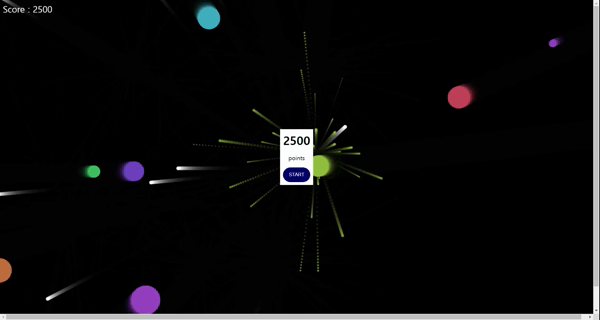

# 자바스크립트로 만든 슈팅 게임
https://shin-3117.github.io/JS_Shooting_game/
## 사용 기술 스텍


HTML의 canvas tag와 JavaScript의 animate() 기능을 사용하여 만들었습니다.



## 플레이 방법
마우스로 클릭으로 총알이 나갑니다.
```
addEventListener("click",(event)=>{ })
```
를 사용하여 마우스 클릭시 `event.clientX event.clientY`를 통해 좌표를 구하고 삼각함수를 이용하여 해당 좌표로 이동하는 총알을 만드는 방식으로 구현했습니다.